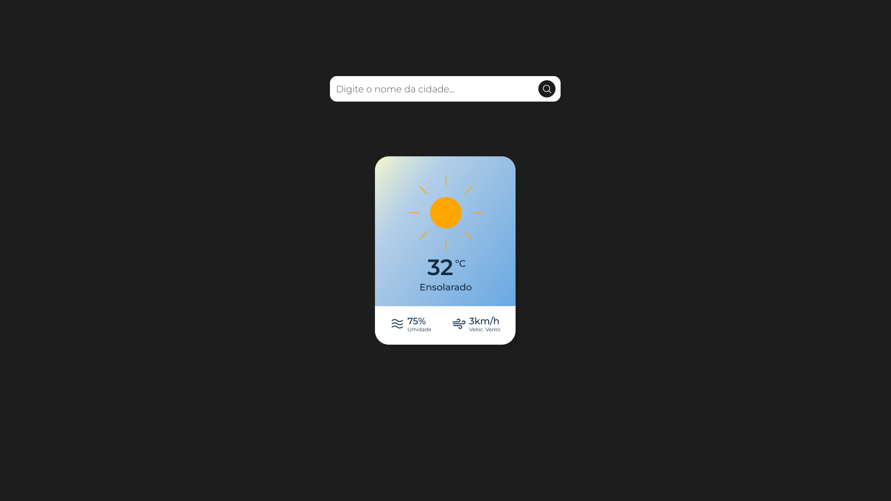
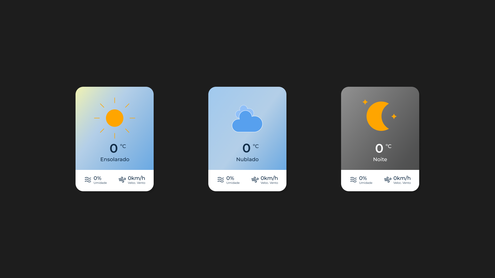

 

 
 

# Teste para vaga de Estágio Fullstack no Magazord.com.br
Este repositório tem como fim testar os candidatos para vaga de desenvolvedor Desenvolvedor Fullstack na empresa [Magazord](https://magazord.com.br).

## O teste

O objetivo deste teste é garantir que suas habilidades de programação sejam postas a prova. 
O importante é o funcionamento e o cumprimento com os requisitos e utilização de boas práticas de programação. 

Será um sistema simples de visualização do tempo consumindo as API's publicas.

### Exemplo Final

### Variações de background

## Requisitos funcionais:

- RF01 - O sistema deve ter um campo do tipo Select / Combobox para a seleção da cidade.

- RF02 - O sistema deve apresentar um indicador de carregamento enquanto aguarda as chamadas de API.

- RF03 - O sistema deve informar o usuário em caso de dados indisponíveis, perda de conexão com o backend ou cidade inválida.

- RF04 - O sistema deve carregar a tela com a cidade atual do usuário pré-carregada (Utilizar IP e geolocalização).

## Requisitos não funcionais:

- RNF01 - O sistema deve utilizar JS, HTML, CSS.

- RNF02 - As chamadas de APi's públicas devem ser feitas através do Backend.

- RNF03 - O sistema deverá ter seu controle de versão no Github.

## Links para documentação de ferramentas utilizadas.

- [OpenWeatherAPI](https://openweathermap.org/current)
- [IP-API](https://ip-api.com/)
- [Repostiório de arquivos](/assets/)

## Envio do teste

* Suba o repositório no seu Github e envie o link diretamente para o seu recrutador.
Obs.: Não serão aceitos alterações após o envio.